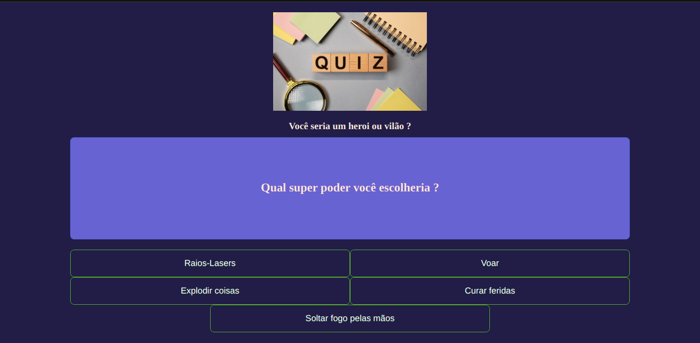

# Buzzfeed

---

## Indice

- [Buzzfeed](#buzzfeed)
  - [Indice](#indice)
  - [Sobre](#sobre)
  - [Funcionalidade da Aplicação](#funcionalidade-da-aplicação)
  - [Imagem](#imagem)
  - [Tecnologias utilizadas](#tecnologias-utilizadas)
  - [Como baixar o projeto](#como-baixar-o-projeto)
  - [Autor](#autor)
  
---

## Sobre 

O Projeto **Buzzfeed** é um clone simples de um quiz.

---

## Funcionalidade da Aplicação

A aplicação exemplo consiste em um clone básico de um quiz, As funcionalidades são:
- Lista pergunta e respostas para que o usuário selecione uma opção e ao final tem uma respota informando se o usuário é um super héroi ou um super vilão.

---
## Imagem

<h1>
  
</h1>


---
## Tecnologias utilizadas 

O projeto foi desenvolvido utilizando as seguintes tecnologias
- Angular 12
- HTML
- CSS
- TypeScript

---

## Como baixar o projeto

```bash
# Clonar o repositório em sua máquina 
$ git clone https://github.com/francelinom/buzzfeed.git

# Entrar na pasta do projeto 
$ cd buzzfeed.

# Instalar todas as dependências 
$ npm i

# Iniciar o projeto 
npm run dev
# or
yarn dev

Abrir o projeto na porta: http://localhost:4200
```

---
## Autor

Desenvolvido por **Francelino Marcílio da Silva** 
<h1>
  
</h1>

